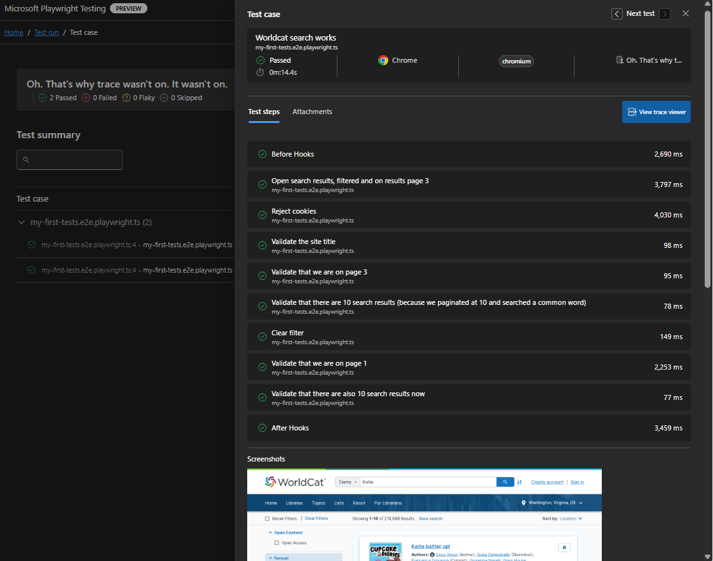

```powershell
cd e2e-worldcat-search
npm install
npm run test
```

[Playwright tests source code for Worldcat](/e2e-worldcat-search/src/my-e2e-tests/my-first-tests.e2e.playwright.ts)



Same test, different test engines:

* [splunk-synthetic-01](https://github.com/kkgthb/splunk-synthetic-01)
* [Browserstack](https://katiekodes.com/browserstack-windows-firewall-wss/)